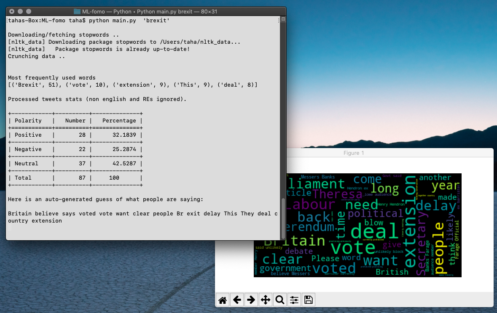

# ML-fomo
There is an in-depth look at the terms and structure of this project <a href="https://medium.com/@hitaha/how-to-fight-social-media-anxiety-with-machine-learning-e10b9ec630e4">on Medium</a>.

## PRELUDE
If you have the compulsive urge to check social media apps throughout the day and miss most of what happens outside your device screen in process, you might suffer from what science call "<a href="https://www.psychologytoday.com/us/blog/ritual-and-the-brain/201804/the-science-fomo-and-what-we-re-really-missing-out">Fear-of-missing-out</a>"
<br />
Some people, myself included, see a trending topic and really hate being forced to scroll endlessly through Twitter to try to figure out what is that all about.<br>

But hey, we are in 2019, we can train our machine to extract the relevant information of us, and do it fast!<br />


## DESCRIPTION
In this project, we classify people's tweets by estimating their opinions/polarities, we try to distinguish the most relevant terms between thousands of words, and finally, generate a conclusion of what the general opinion is.



<i>example output for <b>Brexit</b> search term</i>

## PREREQUISITES
<i>Python 3.7.1 and pip 19.0.3 were used in the development of this project, any Python 3.x version should work just fine.</i>
* Python
* Python pip: `sudo apt-get install python-pip` (Linux Debian family)

## INSTALLATION
Make sure your environment meets the rerequisites.<br />
* clone/download this repo to your workspace <br />
``git@github.com:tahaHichri/ML-fomo.git``
* Go ahead and run the install script and wait for all the dependencies to be downloaded.<br />
``python install/install.py``
* Let's fetch the models<br />
``python -m textblob.download_corpora lite`` <br />

## GET STARTED
Once you get everything nice and ready, the only thing that remains is to set your <a href ="https://developer.twitter.com/en/apply-for-access.html">twitter dev keys</a>.<br/>
That will allow your app to communicate with the Twitter API.

There are 4 placeholders on line 62, 63, 64, and 65 in <i>main.py</i> file.

```python
# TODO insert your Twitter API keys here
# Create a developer account and request access
# @link{ https://developer.twitter.com/en/apply-for-access.html} 
consumer_key        = '<consumer_key>'
consumer_secret     = '<consumer_secret>'
access_token        = '<access_token>'
access_token_secret = '<access_token_secret>'
```

## USAGE

Command pattern: `python main.py <term> <limit>`
<br /> Example call: 
`python main.py 'Metallica' 100`


Argument      | Required         | Type
------------- | -----------------|-------------
query         | YES              | string
limit         | NO (default 500) | int


## KNOWN LIMITATIONS
These are the know limitations that I will be trying to overcome as the project progresses.
* This is the initial version (pre-alpha) contributions/feedback are welcome.
* For now, non-english tweets are not taken into consideration for dictionary (most frequently used words) generation, nor overall description, however, they are part of the initial polarity classification.

## LICENSE
This software is GPL licensed. The work based off of it must be released as open source.

This program is free software: you can redistribute it and/or modify it under the terms of the GNU General Public License as published by the Free Software Foundation, either version 3 of the License, or (at your option) any later version.

This program is distributed in the hope that it will be useful, but WITHOUT ANY WARRANTY; without even the implied warranty of MERCHANTABILITY or FITNESS FOR A PARTICULAR PURPOSE. See the GNU General Public License for more details.
 


